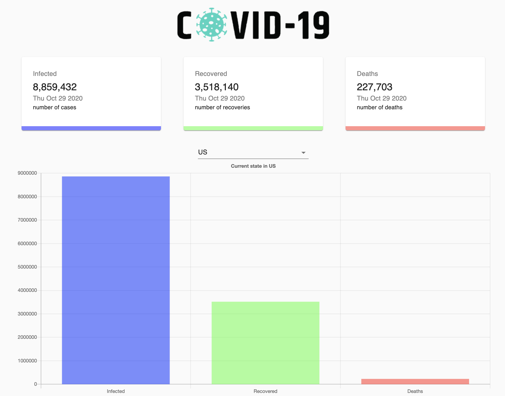

# Covid-Tracker

* An app that displays Covid-19 data in the form of Line and Bar charts.
* The app uses Javascript and React. 
* Api data is always changing, so data displayed can at times seem questionable.

# Live version via Netlify

https://global-covid-tracker-app.netlify.app/

# Set-up

* npm i 
* npm start

# npm packages used

* @material-ui/core
* axios
* chart.js

